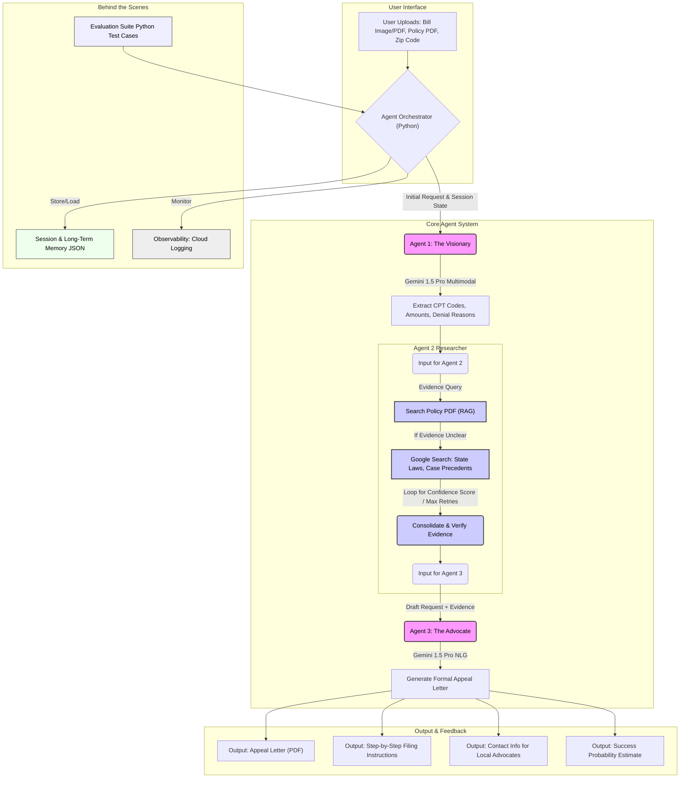

Project Title: Claim Compass: AI-Powered Patient Advocacy Agent
Track: Agents for Good
Project Description
Medical billing errors and insurance claim denials cost Americans billions annually, yet most patients lack the expertise to effectively challenge them. Claim Compass is a multi-agent AI system that democratizes patient advocacy by automatically analyzing medical bills, cross-referencing complex insurance policies, researching applicable legal protections, and generating professionally crafted appeal letters—reducing a 3-hour manual process to minutes.
Problem Statement
The Challenge: Navigating health insurance denials is overwhelming for average patients:

Insurance policies span 100+ pages of dense legal language
Medical billing codes (CPT codes) are cryptic and unintelligible
Federal and state protections exist (like the No Surprises Act) but most patients don't know how to cite them
Result: An estimated 50-70% of denied claims are never appealed, even when the denial is incorrect

Patients without medical billing expertise simply pay erroneous bills rather than fighting back—perpetuating a system where insurers profit from complexity.
The Solution: Multi-Agent Architecture
Claim Compass uses a sequential multi-agent system powered by Google Vertex AI and the Google AI Developer Kit (ADK), featuring:
Agent 1: The Visionary (Vision Analysis)

Technology: Gemini 2.5 Flash (Multimodal Vision)
Function: Performs intelligent OCR on uploaded medical bill images (JPG/PNG/PDF)
Output: Structured extraction of:

Provider name and service date
CPT procedure codes with descriptions
Billed amounts vs. patient responsibility
Denial reasons and codes
Insurance payment details

Agent 2: The Researcher (Evidence Gathering)

Technology: Coordinated dual-specialist system using Gemini 2.5 Pro
Sub-Agent 2a (Policy Researcher):

Uses Vertex AI Search (RAG) with Discovery Engine
Queries uploaded insurance policy PDFs (e.g., university benefit guides, employer plans)
Retrieves specific coverage limits, exclusions, and medical necessity criteria
Returns policy-grounded evidence with source citations

Sub-Agent 2b (Legal Researcher):

Uses Google Search Tool (built-in ADK capability)
Finds federal/state protections (No Surprises Act, state insurance laws)
Locates relevant case precedents and regulatory guidelines
Provides external legal evidence with citations

Agent 3: The Advocate (Letter Generation)

Technology: Gemini 2.5 Pro (Natural Language Generation)
Function: Synthesizes bill data, policy evidence, and legal research into a formal, professional appeal letter
Output: Ready-to-mail appeal that:

Clearly states the patient's case
Cites specific policy language from the uploaded PDF
References applicable federal/state laws
Requests specific reconsideration actions
Maintains professional, respectful tone

Orchestration Layer

Boss Agent (Claim Coordinator): Uses Google ADK's agent-as-tool pattern to orchestrate the workflow
Workflow: Vision → Policy Research → Legal Research → Synthesis → Letter Generation
Session Management: Maintains state throughout the multi-step process

Key Concepts Implemented
✅ Multi-Agent System (Sequential + Hierarchical)

Boss coordinator agent delegates to three specialized sub-agents
Sequential handoff: Vision → Researcher → Writer
Parallel research: Policy and Legal researchers work on different knowledge sources

✅ Tools & RAG Integration

Custom Tool: search_policy_documents() for Vertex AI Search/Discovery Engine
Built-in Tool: google_search for real-time legal research
RAG Architecture: Grounds AI responses in uploaded policy PDFs to prevent hallucinations

✅ Sessions & State Management

Uses InMemoryRunner with session service from Google ADK
Maintains conversation state across agent handoffs
Tracks bill data, research findings, and generation context

✅ Intelligent Context Engineering

Agents adapt logic based on denial reasons (e.g., "Out of Network" vs. "Experimental Treatment")
Dynamic prompt engineering: cites No Surprises Act for emergency bills, focuses on policy limits for benefit denials
Evidence-based synthesis: only includes claims supported by retrieved documents

✅ Observability

Python logging framework throughout agent pipeline
Structured logging for agent transitions and tool calls
Test validation suite (test_setup.py) for configuration verification

Technology Stack
Core Framework:

Google AI Developer Kit (ADK) - Agent orchestration and tool integration
Google Vertex AI - Model serving and agent runtime
Gemini 2.5 Pro - Coordinator and writer agents (reasoning)
Gemini 2.5 Flash - Vision agent (multimodal OCR)

Supporting Technologies:

Vertex AI Search (Discovery Engine) - RAG for policy documents
Streamlit - User interface and file upload
Python 3.10+ - Backend logic and async orchestration
Google Cloud Platform - Infrastructure and deployment

APIs & Libraries:

google-adk - Agent framework
google-cloud-discoveryengine - RAG search client
google-genai - Vertex AI model client
nest_asyncio - Async event loop management

Value Delivered
Impact Metrics:

Reduces appeal letter creation from 3+ hours to ~5 minutes
Eliminates need for medical billing expertise
Provides specific policy citations that strengthen appeal success rates
Makes federal protections accessible to average patients

Democratization of Healthcare Advocacy:
By automating the complex research and writing process, Claim Compass levels the playing field—enabling any patient to fight back against erroneous denials with the same quality of advocacy previously available only to those who could afford medical billing specialists.
Deployment & Access
Repository: [Your GitHub Link]
Live Demo: [Cloud Run URL] (if deployed)
Video Walkthrough: [YouTube Link] (if created)
Setup Instructions
bash# 1. Clone repository
git clone [your-repo-url]
cd claim-compass

# 2. Install dependencies
pip install -r requirements.txt

# 3. Configure Google Cloud
export GOOGLE_CLOUD_PROJECT="your-project-id"
gcloud auth application-default login

# 4. Update config.py with your:
#    - PROJECT_ID
#    - DATA_STORE_ID (Vertex AI Search)
#    - LOCATION

# 5. Validate setup
python test_setup.py

# 6. Run application
streamlit run app.py
Future Enhancements

Memory Bank Integration: Learn from successful appeals to improve future letters
Multi-state Legal Database: Expand beyond federal law to all 50 states
Appeal Success Tracking: Monitor outcomes to refine strategies
Direct Submission Integration: Auto-file appeals through insurer portals
MCP Integration: Connect to real-time healthcare pricing databases

