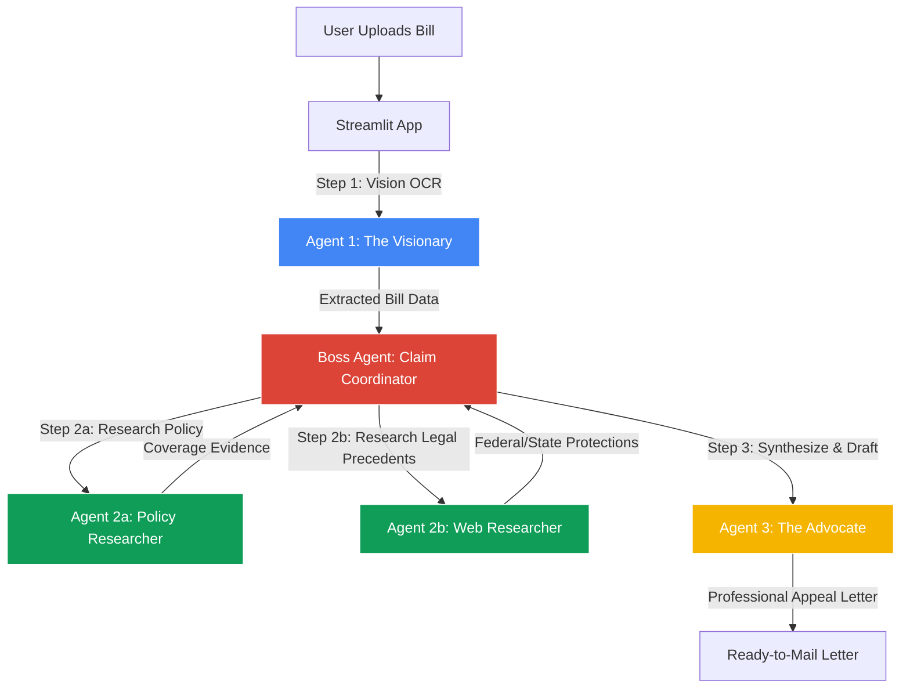
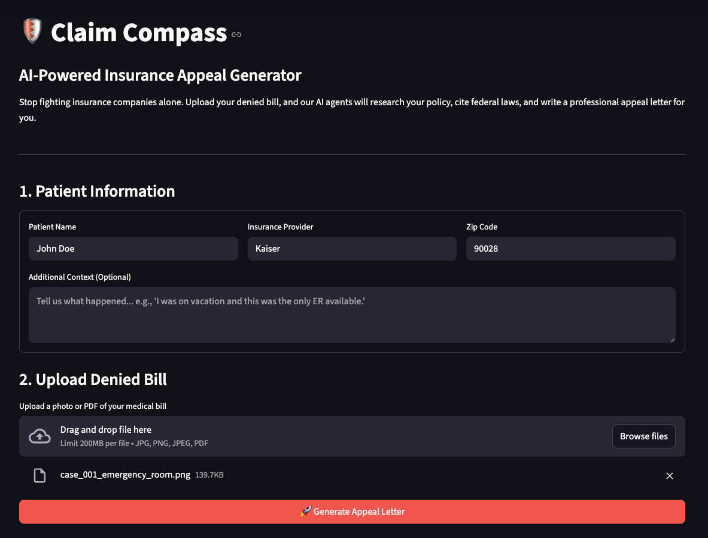
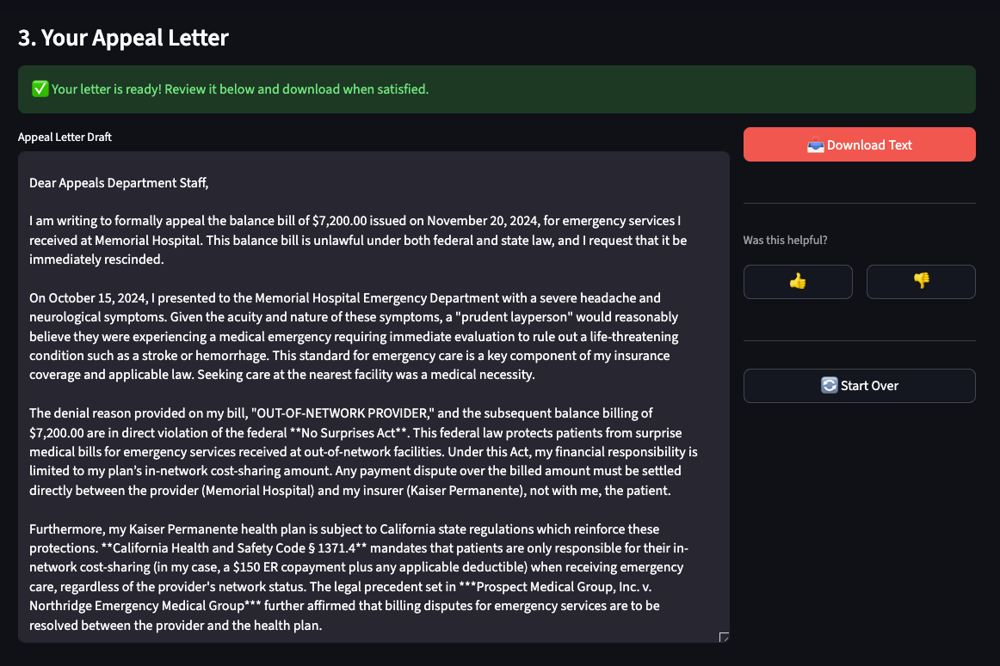

# Claim Compass: AI-Powered Patient Advocacy Agent
### 🏆 Track: Agents for Good

> **Democratizing healthcare advocacy by turning a 3-hour manual appeal process into a 5-minute automated workflow.**

## 📖 Project Description

Medical billing errors and insurance claim denials cost Americans billions annually, yet most patients lack the expertise to effectively challenge them. **Claim Compass** is a multi-agent AI system that democratizes patient advocacy. By automatically analyzing medical bills, cross-referencing complex insurance policies, researching applicable legal protections, and generating professionally crafted appeal letters, Claim Compass levels the playing field against large insurers.

## ⚠️ The Problem

Navigating health insurance denials is overwhelming for the average patient.

* **The Complexity:** Insurance policies often span 100+ pages of dense legal language, and medical bills use cryptic CPT codes.
* **The Knowledge Gap:** While federal protections (like the *No Surprises Act*) exist, most patients do not know how to cite them.
* **The Result:** An estimated **50-70% of denied claims are never appealed**, even when the denial is incorrect. Patients often pay erroneous bills simply to avoid the stress of fighting back—perpetuating a system where insurers profit from complexity.

## 💡 The Solution: Multi-Agent Architecture

Claim Compass utilizes a **hierarchical multi-agent system** powered by Google Vertex AI and the Agent Development Kit (ADK).
### 🏗️ System Architecture



### 🤖 The Agents

#### 1. The Visionary (Vision Analysis)
* **Technology:** Gemini 2.5 Flash (Multimodal Vision)
* **Function:** Performs intelligent OCR on uploaded medical bill images (JPG/PNG/PDF).
* **Output:** Structured extraction of Provider/Service Date, CPT Codes, Billed vs. Responsibility, and Denial Codes.

#### 2. The Researcher Team (Evidence Gathering)
A coordinated dual-specialist system orchestrated using the Boss Agent.
* **Sub-Agent 2a (Policy Researcher):**
    * **Technology** Gemini 2.5 Pro + Vertex AI Search (RAG)
    * **Function:** Queries uploaded policy documents using semantic search
    * **Tool:** Custom `search_policy_documents()` via Vertex AI Discovery Engine
    * **Output:** Specific policy sections, coverage limits, exclusions, and medical necessity criteria
* **Sub-Agent 2b (Web Researcher):**
    * **Technology:** Gemini 2.5 Pro + Google Search API
    * **Function:** Finds federal/state protections (e.g., No Surprises Act, ACA clinical trial mandates)
    * **Tool:** Built-in Google Search (ADK)
    * **Output:** Relevant case precedents, regulatory guidelines, and consumer protections
**Sequential Strategy**: Policy findings from Agent 2a inform the search queries for Agent 2b, ensuring legal research is targeted to the patient's specific insurance provider and policy terms.

#### 3. The Advocate (Letter Generation)
* **Technology:** Gemini 2.5 Pro (Natural Language Generation)
* **Function:** Synthesizes bill data, policy evidence, and legal research.
* **Output:** Formal, professional appeal letter citing specific policy language, federal laws, and case precedents

## 🛂 Orchestration Layer: The Boss Coordinator
The `ClaimCoordinator` agent manages the entire workflow using sequential delegation:
1. **Perception Phase:** Receives structured bill data from Vision Agent
2. **Policy Research Phase:** Delegates to Policy Researcher to find coverage rules
3. **Legal Research Phase:** Delegates to Web Researcher (informed by policy findings)
4. **Synthesis Phase:** Aggregates all research evidence
5. **Generation Phase:** Delegates to Writer Agent with consolidated context
6. **Output:** Returns completed appeal letter to user

**Why Sequential?** Each research phase builds upon the previous one. Policy-specific findings (e.g., "Kaiser excludes experimental treatments per Section 7.2(f)") directly inform targeted web searches (e.g., "ACA clinical trial coverage requirements"), resulting in more relevant and persuasive legal citations.

## User Interface



## 🔑 Key Concepts Implemented

✅ **Multi-Agent System (Sequential + Hierarchical):** Boss coordinator delegates to 4 specialized sub-agents with intelligent handoffs between research phases  
✅ **Tools & RAG Integration:**
   - Custom Tool: `search_policy_documents()` via Vertex AI Search
   - Built-in Tool: Google Search for real-time legal information
   - **RAG Architecture:** Strictly grounds responses in uploaded policy PDFs to prevent hallucinations

✅ **Sessions & State Management:** Uses `InMemoryRunner` with unique session IDs to maintain conversation state across agent handoffs  
✅ **Context Engineering:** Dynamic prompting adapts based on insurance provider and denial type (e.g., emergency care vs. benefit limits)  
✅ **Pure Async Architecture:** Native async/await throughout (Vision, Coordinator, Streamlit integration) with no event loop hacks—production-ready for async runtimes  
✅ **Custom Observability Stack:** Implements the "Three Pillars of Observability" (Logs, Traces, Metrics) tracking agent reasoning, tool usage duration, and success rates  
✅ **Automated Evaluation Pipeline:** LLM-as-a-Judge scoring system with golden test cases achieving **91.7% average quality** across vision accuracy, research relevance, and letter persuasiveness

---

## 🛠️ Technology Stack

| Category | Technology |
|----------|-----------|
| **Core Framework** | Google AI Developer Kit (ADK) |
| **Runtime** | Google Vertex AI |
| **Models** | Gemini 2.5 Pro (Reasoning), Gemini 2.5 Flash (Vision) |
| **RAG / Search** | Vertex AI Search (Discovery Engine) |
| **Frontend** | Streamlit |
| **Language** | Python 3.13 |
| **Infrastructure** | Google Cloud Platform (Cloud Run) |

---

## 🚀 Impact & Value

- **Time Savings:** Reduces appeal creation from 3+ hours to **~2 minutes** (average processing time: 119 seconds)
- **Accessibility:** Eliminates the need for expensive medical billing expertise
- **Accuracy:** Provides specific policy citations (e.g., "Section 7.2(f)") and federal law references (ACA, No Surprises Act) to strengthen appeal success rates
- **Equity:** Makes federal protections accessible to average patients, regardless of income or education level

### 📊 Real-World Performance

Based on automated evaluation suite results:

- **Average Quality Score:** 91.7%
- **Policy Search Success Rate:** 95% (successfully retrieves relevant coverage rules)
- **Legal Citation Quality:** 97.5% (accurate ACA and case precedent citations)
- **Processing Time:** ~2 minutes per appeal

#### Sample Output
From a real $45,975 experimental cancer treatment denial, our system generated a **3,667-character appeal letter** citing:
- Affordable Care Act clinical trial coverage mandate
- Kaiser policy Section 7.2(f) (retrieved via RAG)
- Three legal precedents (*Boldon v. Humana*, *Potter v. Blue Cross*, *Reed v. Wal-Mart*)
- NCI trial sponsorship verification (NCT04567890)

*[See full evaluation results](evaluation_results/evaluation_20251125_214137.json)*

---

## 💻 Setup Instructions

### Prerequisites
- Python 3.10+
- Google Cloud Project with Vertex AI API enabled
- Vertex AI Search data store configured with policy documents

### Installation
```bash
# 1. Clone repository
git clone https://github.com/yourusername/claim-compass.git
cd claim-compass

# 2. Create virtual environment
python -m venv .venv
source .venv/bin/activate  # On Windows: .venv\Scripts\activate

# 3. Install dependencies
pip install -r requirements.txt

# 4. Configure Google Cloud Auth
export GOOGLE_CLOUD_PROJECT="your-project-id"
gcloud auth application-default login
```

### Configuration

Update `config.py` with your specific Google Cloud details:
```python
PROJECT_ID = "your-project-id"
DATA_STORE_ID = "your-vertex-search-datastore-id"
LOCATION = "us-central1"
VISION_LOCATION = "us-east1"
```

### Running the App
```bash
# 1. Validate setup configuration
python test_setup.py

# 2. Run the Streamlit application
streamlit run app.py
```

### Running the Evaluation Suite
```bash
# Test agent quality on golden dataset
python run_evaluation.py
```

---

## 🌐 Deployment (Google Cloud Run)

The project is containerized for production deployment:
```bash
# 1. Build the container
gcloud builds submit --tag gcr.io/$PROJECT_ID/claim-compass .

# 2. Deploy to Cloud Run
gcloud run deploy claim-compass \
  --image gcr.io/$PROJECT_ID/claim-compass \
  --platform managed \
  --region us-central1 \
  --allow-unauthenticated \
  --set-env-vars GOOGLE_CLOUD_PROJECT=$PROJECT_ID,DATA_STORE_ID=$DATA_STORE_ID
```

**Live Demo:** https://claim-compass-360592085162.us-central1.run.app

---

## 🔮 Future Enhancements

- [ ] **Memory Bank Integration:** Learn from successful appeals to improve future generation
- [ ] **Multi-State Legal Database:** Expand specific legal knowledge beyond federal law to all 50 states
- [ ] **Appeal Success Tracking:** Monitor user outcomes to refine strategies
- [ ] **Direct Submission:** Auto-file appeals through insurer portals via API integration
- [ ] **MCP Integration:** Connect to real-time healthcare pricing databases for cost validation
- [ ] **Multi-Language Support:** Generate appeals in Spanish and other languages for accessibility

---

## 🎬 Demo & Links

- **Live Application:** https://claim-compass-360592085162.us-central1.run.app
- **Video Walkthrough:** *[Coming Soon]*
- **GitHub Repository:** https://github.com/yourusername/claim-compass
- **Evaluation Results:** [evaluation_results/evaluation_20251125_214137.json](evaluation_results/evaluation_20251125_214137.json)

---

## 📄 License

This project is open-source and available under the MIT License.

---

## 🙏 Acknowledgments

Built for the **5-Day AI Agents Intensive Course with Google** (Nov 10-14, 2025).  
Special thanks to the Google AI team for the Agent Development Kit and Kaggle for hosting the Capstone Project.

---

## 🔒 Security Note

⚠️ **Never commit API keys or credentials to version control.** This project uses Google Cloud Application Default Credentials (ADC) for authentication. Ensure your `.env` files are included in `.gitignore`.

---
