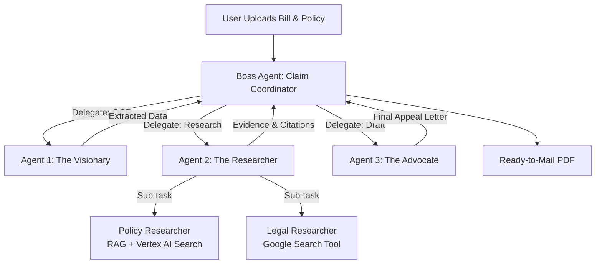

# Claim Compass: AI-Powered Patient Advocacy Agent
### 🏆 Track: Agents for Good

> **Democratizing healthcare advocacy by turning a 3-hour manual appeal process into a 5-minute automated workflow.**

## 📖 Project Description

Medical billing errors and insurance claim denials cost Americans billions annually, yet most patients lack the expertise to effectively challenge them. **Claim Compass** is a multi-agent AI system that democratizes patient advocacy. By automatically analyzing medical bills, cross-referencing complex insurance policies, researching applicable legal protections, and generating professionally crafted appeal letters, Claim Compass levels the playing field against large insurers.

## ⚠️ The Problem

Navigating health insurance denials is overwhelming for the average patient.

* **The Complexity:** Insurance policies often span 100+ pages of dense legal language, and medical bills use cryptic CPT codes.
* **The Knowledge Gap:** While federal protections (like the *No Surprises Act*) exist, most patients do not know how to cite them.
* **The Result:** An estimated **50-70% of denied claims are never appealed**, even when the denial is incorrect. Patients often pay erroneous bills simply to avoid the stress of fighting back—perpetuating a system where insurers profit from complexity.

## 💡 The Solution: Multi-Agent Architecture

Claim Compass utilizes a sequential multi-agent system powered by **Google Vertex AI** and the **Google AI Developer Kit (ADK)**.

### 🏗️ System Architecture



### 🤖 The Agents

#### 1. The Visionary (Vision Analysis)
* **Technology:** Gemini 2.5 Flash (Multimodal Vision)
* **Function:** Performs intelligent OCR on uploaded medical bill images (JPG/PNG/PDF).
* **Output:** Structured extraction of Provider/Service Date, CPT Codes, Billed vs. Responsibility, and Denial Codes.

#### 2. The Researcher (Evidence Gathering)
A coordinated dual-specialist system using **Gemini 2.5 Pro**.
* **Sub-Agent 2a (Policy Researcher):**
    * Uses **Vertex AI Search (RAG)** with Discovery Engine.
    * Queries uploaded policy documents (Benefit guides, plans).
    * Retrieves coverage limits, exclusions, and medical necessity criteria.
* **Sub-Agent 2b (Legal Researcher):**
    * Uses **Google Search Tool** (ADK capability).
    * Finds federal/state protections (e.g., *No Surprises Act*, state insurance laws).
    * Locates relevant case precedents and regulatory guidelines.

#### 3. The Advocate (Letter Generation)
* **Technology:** Gemini 2.5 Pro (Natural Language Generation)
* **Function:** Synthesizes bill data, policy evidence, and legal research.
* **Output:** A formal, professional appeal letter that cites specific policy language, references applicable laws, and requests reconsideration.

#### 🛂 Orchestration Layer
The **Boss Agent (Claim Coordinator)** uses Google ADK's agent-as-tool pattern to manage state and handoffs: `Vision → Policy Research → Legal Research → Synthesis → Letter Generation`.

## 🔑 Key Concepts Implemented

* ✅ **Multi-Agent System (Sequential + Hierarchical):** Boss coordinator delegates to specialized sub-agents with sequential handoffs (Vision → Researcher → Writer) and parallel research tracks.
* ✅ **Tools & RAG Integration:**
    * Custom Tool: `search_policy_documents()` via Vertex AI Search.
    * Built-in Tool: `Google Search` for real-time legal info.
    * **RAG Architecture:** Strictly grounds responses in uploaded policy PDFs to prevent hallucinations.
* ✅ **Sessions & State Management:** Uses `InMemoryRunner` to maintain conversation state across agent handoffs and track bill data/research findings.
* ✅ **Intelligent Context Engineering:** Dynamic prompting adapts based on denial reasons (e.g., citing the *No Surprises Act* for emergency bills vs. policy limits for benefit denials).
* ✅ **Observability:** Python logging framework for agent transitions and tool calls.

## 🛠️ Technology Stack

| Category | Technology |
| :--- | :--- |
| **Core Framework** | Google AI Developer Kit (ADK) |
| **Runtime** | Google Vertex AI |
| **Models** | Gemini 2.5 Pro (Reasoning), Gemini 2.5 Flash (Vision) |
| **RAG / Search** | Vertex AI Search (Discovery Engine) |
| **Frontend** | Streamlit |
| **Language** | Python 3.10+ |
| **Infrastructure** | Google Cloud Platform (Cloud Run) |

## 🚀 Impact & Value

* **Time Savings:** Reduces appeal creation from **3+ hours** to **~5 minutes**.
* **Accessibility:** Eliminates the need for expensive medical billing expertise.
* **Accuracy:** Provides specific policy citations and federal law references to strengthen appeal success rates.
* **Equity:** Makes federal protections accessible to average patients.

## 💻 Setup Instructions

### Prerequisites
* Python 3.10+
* Google Cloud Project with Vertex AI API enabled

### Installation

```bash
# 1. Clone repository
git clone [your-repo-url]
cd claim-compass

# 2. Install dependencies
pip install -r requirements.txt

# 3. Configure Google Cloud Auth
export GOOGLE_CLOUD_PROJECT="your-project-id"
gcloud auth application-default login
```

### Configuration
Update `config.py` with your specific Google Cloud details:
* `PROJECT_ID`
* `DATA_STORE_ID` (Vertex AI Search)
* `LOCATION`

### Running the App

```bash
# 1. Validate setup configuration
python test_setup.py

# 2. Run the Streamlit application
streamlit run app.py
```

## 🔮 Future Enhancements

- [ ] **Memory Bank Integration:** Learn from successful appeals to improve future generation.
- [ ] **Multi-state Legal Database:** Expand specific legal knowledge beyond federal law to all 50 states.
- [ ] **Appeal Success Tracking:** Monitor user outcomes to refine strategies.
- [ ] **Direct Submission:** Auto-file appeals through insurer portals.
- [ ] **MCP Integration:** Connect to real-time healthcare pricing databases.

---

### 🔗 Links
* **Live Demo:** [Cloud Run URL]
* **Video Walkthrough:** [YouTube Link]
