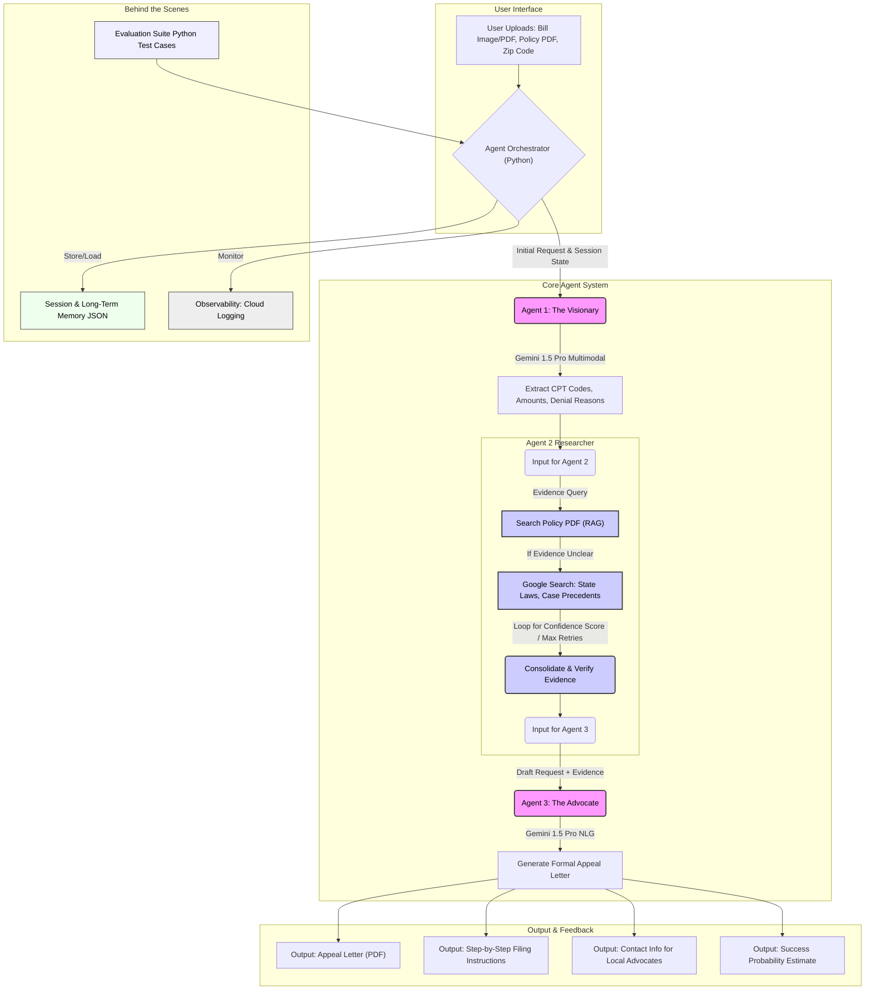

```mermaid
graph TD
    subgraph User Interface
        A["User Uploads: Bill Image/PDF, Policy PDF, Zip Code"] --> B{"Agent Orchestrator (Python)"}
    end

    subgraph Core Agent System
        B -- Initial Request & Session State --> C1("Agent 1: The Visionary")
        C1 -- Gemini 1.5 Pro Multimodal --> C1_1["Extract CPT Codes, Amounts, Denial Reasons"]
        C1_1 --> C2_in("Input for Agent 2")

        subgraph Agent 2 Researcher
            direction TB
            C2_in -- Evidence Query --> C2_1["Search Policy PDF (RAG)"]
            C2_1 -- If Evidence Unclear --> C2_2["Google Search: State Laws, Case Precedents"]
            C2_2 -- Loop for Confidence Score / Max Retries --> C2_3("Consolidate & Verify Evidence")
            C2_3 --> D_in("Input for Agent 3")
        end

        D_in -- Draft Request + Evidence --> D1("Agent 3: The Advocate")
        D1 -- Gemini 1.5 Pro NLG --> D1_1["Generate Formal Appeal Letter"]
    end

    subgraph Output & Feedback
        D1_1 --> E1["Output: Appeal Letter (PDF)"]
        D1_1 --> E2["Output: Step-by-Step Filing Instructions"]
        D1_1 --> E3["Output: Contact Info for Local Advocates"]
        D1_1 --> E4["Output: Success Probability Estimate"]
    end

    subgraph Behind the Scenes
        B -- Store/Load --> F[Session & Long-Term Memory JSON]
        B -- Monitor --> G[Observability: Cloud Logging]
        H[Evaluation Suite Python Test Cases] --> B
    end

    style C1 fill:#f9f,stroke:#333,stroke-width:2px,color:#000
    style C2_1 fill:#ccf,stroke:#333,stroke-width:2px,color:#000
    style C2_2 fill:#ccf,stroke:#333,stroke-width:2px,color:#000
    style C2_3 fill:#ccf,stroke:#333,stroke-width:2px,color:#000
    style D1 fill:#f9f,stroke:#333,stroke-width:2px,color:#000
    
    style F fill:#efe,stroke:#333,stroke-width:1px,color:#000
    style G fill:#eee,stroke:#333,stroke-width:1px,color:#000
    style H fill:#eef,stroke:#333,stroke-width:1px,color:#000
```
